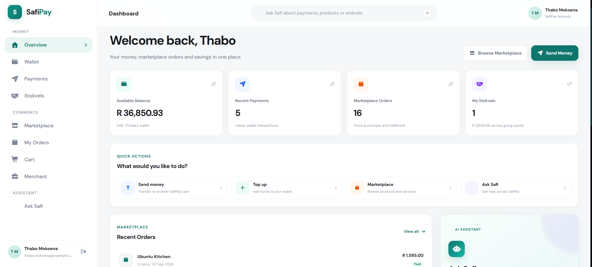
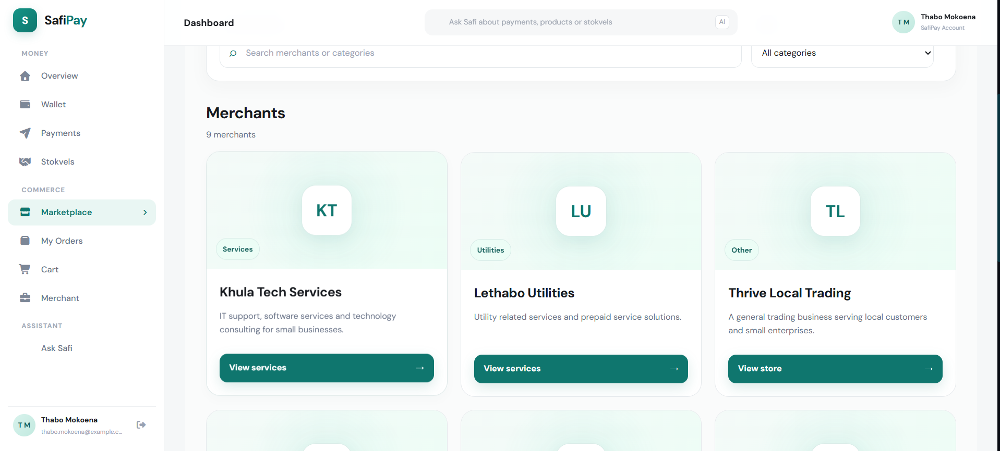
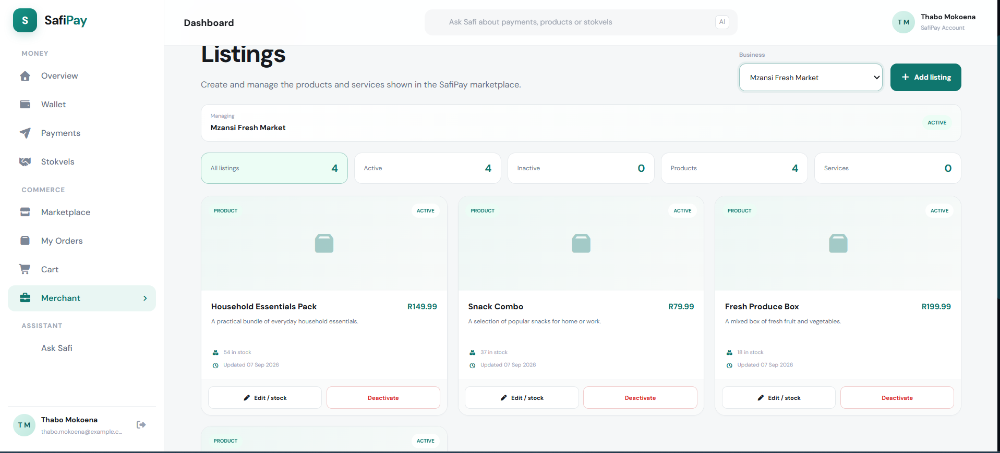
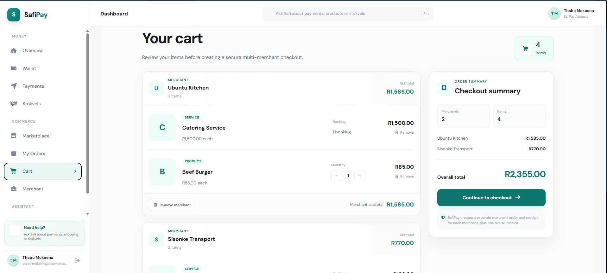
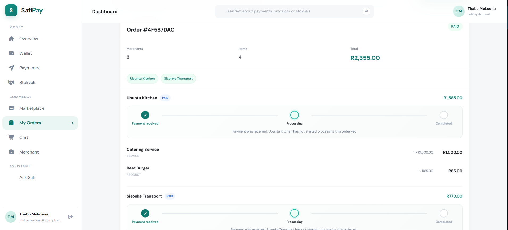
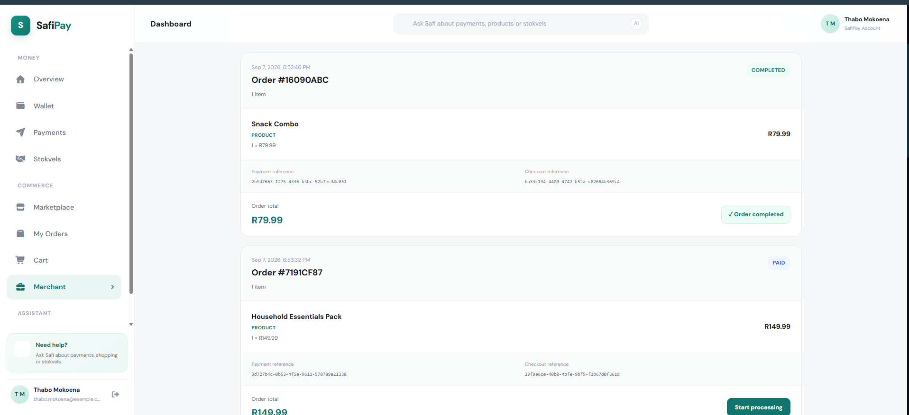

# SafiPay

> AI powered fintech and commerce platform for digital wallets, payments, stokvel savings, merchant tools and marketplace checkout.

SafiPay is a full stack portfolio project built around a microservices architecture. It combines consumer payments, group savings, merchant functionality, a multi merchant marketplace and an AI assistant into one platform.

The project was built to demonstrate backend engineering, distributed system design, API development, authentication, database design, Docker, frontend integration and practical AI integration.

---

## Project Status

**Portfolio version: Complete**

SafiPay is complete as a portfolio project and includes the main end to end flows needed to demonstrate the platform.

It is not presented as a production banking or regulated financial system.

---

# Screenshots


## Dashboard



> Screenshot placeholder: Main dashboard showing wallet balance, recent payments, marketplace orders, stokvels, quick actions and Ask Safi.

---

## Marketplace



> Screenshot placeholder: Marketplace discovery page showing products and services from active merchants.

---

## Merchant Storefront



> Screenshot placeholder: Individual merchant storefront with active listings.

---

## Shopping Cart



> Screenshot placeholder: Multi merchant shopping cart showing grouped products and checkout total.

---

## Checkout Receipt


> Screenshot placeholder: Successful marketplace checkout receipt.

---

## Customer Orders



> Screenshot placeholder: Customer order history with fulfilment status timeline.

---

## Merchant Portal


> Screenshot placeholder: Merchant dashboard with listings, payments and incoming orders.

---

## Merchant Order Management



> Screenshot placeholder: Merchant order management page showing PAID, PROCESSING and COMPLETED orders.

---

## Stokvels


> Screenshot placeholder: Stokvel dashboard showing group savings and contribution information.

---

## Ask Safi


> Screenshot placeholder: Ask Safi recommending marketplace listings or explaining SafiPay data.

---

# Core Features

## Authentication

SafiPay supports authenticated user access using JWT based authentication.

Main capabilities include:

* User registration
* User login
* Protected routes
* Authenticated service requests
* Role based administrative protection
* Secure password hashing

---

## Digital Wallet

Each user can access a SafiPay wallet.

Features include:

* Automatic wallet creation
* Wallet balance retrieval
* Wallet top up
* Internal debit and credit operations
* Wallet based payment settlement

---

## P2P Payments

Users can transfer money to other SafiPay users.

Features include:

* Authenticated sender
* Wallet debit and credit
* Payment history
* Transfer validation
* Transaction tracking

---

## Stokvel Savings

SafiPay includes digital stokvel functionality for group savings.

Features include:

* Create and join stokvels
* View owned or joined stokvels
* Member contributions
* Group pool balances
* Contribution tracking
* Payout support
* Stokvel discovery

---

## Merchant Accounts

Users can create merchant accounts for businesses.

Features include:

* Merchant registration
* Merchant approval and suspension
* Merchant wallet creation
* Merchant ownership checks
* API key management
* Payment history
* Refund support

---

# Marketplace

The SafiPay marketplace is implemented inside the merchant service.

Merchants can create:

```text
PRODUCT
SERVICE
```

Products support stock quantities while services do not require stock.

Marketplace capabilities include:

* Product and service listings
* Public marketplace discovery
* Merchant storefronts
* Search
* Merchant category filtering
* Listing type filtering
* Maximum price filtering
* Active and inactive listing management
* Product stock tracking

---

# Shopping Cart

The Angular frontend includes a local marketplace cart.

The cart supports:

* Products from multiple merchants
* Merchant grouped cart items
* Product quantity changes
* Stock limited quantities
* Service quantity fixed at one
* Local cart persistence
* Server authoritative checkout pricing

The frontend sends listing identifiers and quantities only.

The backend determines:

```text
Authenticated buyer
Database listing price
Merchant ownership
Order total
```

This prevents the browser from becoming the authoritative source for payment amounts.

---

# Multi Merchant Checkout

A single SafiPay checkout can contain products from multiple merchants.

Example:

```text
MarketplaceCheckout
│
├── MerchantOrder
│   ├── MerchantOrderItem
│   └── MerchantOrderItem
│
└── MerchantOrder
    └── MerchantOrderItem
```

Each merchant receives a separate order while the customer sees one overall checkout.

Checkout statuses include:

```text
PENDING
PROCESSING
PAID
PARTIALLY_PAID
FAILED
CANCELLED
```

Merchant order statuses include:

```text
PENDING_PAYMENT
PAID
PAYMENT_FAILED
PROCESSING
COMPLETED
CANCELLED
REFUNDED
```

---

# Marketplace Payments

Marketplace payments use the authenticated buyer and server stored order totals.

Payment flow:

```text
Customer
   ↓
Marketplace Checkout
   ↓
Merchant Order
   ↓
Buyer Wallet Debit
   ↓
Merchant Wallet Credit
   ↓
Merchant Payment
   ↓
Order PAID
   ↓
Stock Reduction
```

SafiPay currently applies a **1.5% merchant fee**.

The customer pays the full order amount while the merchant receives the order amount minus the merchant fee.

---

# Failed Payment Recovery

Multi merchant checkout supports partial failure recovery.

If one merchant payment fails while others succeed:

```text
Checkout
   ↓
PARTIALLY_PAID
   ↓
Failed Merchant Order
   ↓
Retry Payment
   ↓
PAID
```

Customers can retry only the merchant order that failed.

Successful merchant orders are not charged again.

---

# Payment Idempotency

Marketplace payment flows include protection against duplicate payment attempts.

This helps protect against:

* Double clicking payment buttons
* Browser retries
* Duplicate HTTP requests
* Repeated marketplace payment processing

---

# Stock Concurrency Protection

SafiPay uses database locking to protect product stock during marketplace payment.

The product row is locked before the payment attempt so two customers cannot both purchase the final unit.

Example:

```text
Stock = 1

Customer A
   ↓
Locks product
   ↓
Pays
   ↓
Stock becomes 0
   ↓
Commit

Customer B
   ↓
Waits for lock
   ↓
Reads stock = 0
   ↓
Rejected before payment
```

---

# Merchant Order Fulfilment

Merchants can manage incoming marketplace orders.

Supported transitions:

```text
PAID
  ↓
PROCESSING
  ↓
COMPLETED
```

The backend verifies:

* The authenticated user owns the merchant
* The order belongs to that merchant
* The requested status transition is valid

---

# Customer Order Tracking

Customers can view marketplace order history and fulfilment progress.

The order timeline includes:

```text
Payment received
Processing
Completed
```

The UI also handles:

```text
PAYMENT_FAILED
CANCELLED
REFUNDED
```

---

# Refunds

Merchant payment refunds are connected to marketplace orders.

Refund flow:

```text
Merchant Payment
COMPLETED
   ↓
Refund
   ↓
Merchant Payment
REFUNDED
   ↓
Merchant Order
REFUNDED
```

A financial refund does not automatically restore product stock because a refund and a physical product return are treated as separate business actions.

---

# PDF Receipts

Customer receipts can be exported as PDF files directly in the browser.

The frontend uses:

```text
jsPDF
jspdf-autotable
```

The backend stores checkout, order and payment information rather than PDF files.

---

# Ask Safi AI

SafiPay includes an AI assistant called **Ask Safi**.

Architecture:

```text
Angular
   ↓
Gateway
   ↓
AI Service
   ↓
Controlled SafiPay APIs
   ↓
Sanitised Context
   ↓
Ollama Cloud
   ↓
Answer
```

Ask Safi can help users:

* Discover marketplace products
* Compare available services
* Explore stokvels
* Understand SafiPay features
* Answer questions using live SafiPay context

Marketplace recommendations are grounded in real listing data supplied by SafiPay.

The AI is not given direct database access.

Sensitive fields are removed before context is sent to the external AI provider.

---

# Architecture

```text
                         ┌─────────────────────┐
                         │   Angular Frontend  │
                         │      Port 4200      │
                         └──────────┬──────────┘
                                    │
                                    ▼
                         ┌─────────────────────┐
                         │   Gateway Service   │
                         │      Port 8080      │
                         └──────────┬──────────┘
                                    │
        ┌───────────────────────────┼───────────────────────────┐
        │                           │                           │
        ▼                           ▼                           ▼
┌───────────────┐          ┌────────────────┐          ┌────────────────┐
│ User Service  │          │ Wallet Service │          │Payment Service │
│     8081      │          │      8082      │          │      8083      │
└───────────────┘          └────────────────┘          └────────────────┘

        │                           │                           │
        ▼                           ▼                           ▼
┌───────────────┐          ┌────────────────┐          ┌────────────────┐
│Stokvel Service│          │ Ledger Service │          │Merchant Service│
│     8084      │          │      8085      │          │      8086      │
└───────────────┘          └────────────────┘          └────────────────┘

        │                           │                           │
        ▼                           ▼                           ▼
┌───────────────┐          ┌────────────────┐          ┌────────────────┐
│ Fraud Service │          │Webhook Service │          │   AI Service   │
│     8087      │          │      8088      │          │      8090      │
└───────────────┘          └────────────────┘          └────────────────┘

                                    │
                                    ▼
                         ┌─────────────────────┐
                         │     PostgreSQL      │
                         └─────────────────────┘
```

---

# Technology Stack

## Backend

```text
Java 17
Spring Boot
Spring Security
Spring Data JPA
PostgreSQL
JWT
Maven
Docker
```

## Frontend

```text
Angular 17
TypeScript
SCSS
Angular Signals
RxJS
jsPDF
```

## AI

```text
Python
FastAPI
Ollama Cloud
gpt-oss:120b
```

## Infrastructure

```text
Docker
Docker Compose
PostgreSQL 15
REST APIs
Microservices
```

---

# Project Structure

```text
safipay/
│
├── backend/
│   ├── pom.xml
│   ├── gateway-service/
│   ├── user-service/
│   ├── wallet-service/
│   ├── payment-service/
│   ├── stokvel-service/
│   ├── ledger-service/
│   ├── merchant-service/
│   ├── fraud-service/
│   ├── webhook-service/
│   └── ai-service/
│
├── frontend/
│   └── safipay-app/
│
├── docs/
│   └── screenshots/
│
├── docker-compose.yml
├── .env.example
└── README.md
```

---

# Running SafiPay

## Prerequisites

Install:

```text
Docker
Docker Compose
Git
```

---

## Clone

```bash
git clone <your-repository-url>
cd Safipay
```

---

## Environment

Create your local environment file from the example:

```bash
cp .env.example .env
```

Add the required local values.

Do not commit secrets to Git.

---

## Start the Platform

From the repository root:

```bash
docker compose up --build
```

Main local URLs:

```text
Frontend
http://localhost:4200

Gateway
http://localhost:8080
```

---

## Stop the Platform

```bash
docker compose down
```

Avoid:

```bash
docker compose down -v
```

unless you intentionally want to remove local PostgreSQL volumes and seeded data.

---

# Main API Areas

## Authentication

```http
POST /api/auth/register
POST /api/auth/login
```

---

## Wallet

```http
GET  /api/wallets/me
POST /api/wallets/top-up
```

---

## Payments

```http
POST /api/payments/send
```

---

## Merchants

```http
POST /api/merchants
GET  /api/merchants/my
GET  /api/merchants/{merchantId}
```

---

## Marketplace Listings

```http
GET    /api/merchants/listings
POST   /api/merchants/{merchantId}/listings
GET    /api/merchants/{merchantId}/listings/manage
GET    /api/merchants/{merchantId}/listings
GET    /api/merchants/{merchantId}/listings/{listingId}
PUT    /api/merchants/{merchantId}/listings/{listingId}
DELETE /api/merchants/{merchantId}/listings/{listingId}
```

---

## Checkout

```http
POST /api/merchants/checkout
POST /api/merchants/checkout/{checkoutId}/pay
GET  /api/merchants/checkout/{checkoutId}
GET  /api/merchants/checkouts/my
```

Failed merchant payments can also be retried individually.

---

## Merchant Orders

```http
GET /api/merchants/{merchantId}/orders
GET /api/merchants/{merchantId}/orders/{orderId}
PUT /api/merchants/{merchantId}/orders/{orderId}/status
```

---

## Merchant Payments

```http
GET  /api/merchants/{merchantId}/payments
POST /api/merchants/{merchantId}/payments/{paymentId}/refund
```

---

## Ask Safi

```http
/api/ai/**
```

---

# Demo Flow

A good SafiPay demonstration can follow this sequence:

```text
1. Register or log in

2. Open wallet
   ↓
   Top up balance

3. Open marketplace
   ↓
   Browse merchant listings

4. Add products to cart
   ↓
   Multi merchant checkout

5. Pay
   ↓
   Receipt generated

6. Open My Orders
   ↓
   Track fulfilment

7. Open Merchant Portal
   ↓
   Move order from PAID
   to PROCESSING
   to COMPLETED

8. Open Ask Safi
   ↓
   Ask for a product or stokvel recommendation
```

---

# Security Design

SafiPay includes several security focused design decisions:

* JWT authentication
* Password hashing
* Protected backend routes
* Merchant ownership checks
* Administrative authorization
* Server side marketplace pricing
* Authenticated buyer identity
* Payment idempotency
* Product stock locking
* Sensitive AI context sanitisation
* API secrets stored outside source control

---

# Known Limitations

SafiPay is a portfolio system rather than a production financial platform.

A production version would require significantly more work around:

* Regulatory compliance
* POPIA and financial data governance
* Formal security review
* Penetration testing
* Distributed tracing
* Production observability
* Advanced fraud detection
* Strong distributed transaction coordination
* Automated reconciliation
* High availability
* Disaster recovery
* Production payment provider integration
* Large scale performance testing

---

# Portfolio Highlights

SafiPay demonstrates experience with:

```text
Microservices architecture
Java and Spring Boot
Angular
REST APIs
PostgreSQL
Docker
JWT authentication
Distributed payment flows
Database concurrency
Idempotency
Marketplace design
AI integration
Secure API design
Error recovery
Frontend and backend integration
```

---

# Future Improvements

SafiPay is feature complete for its portfolio scope.

Possible future extensions include:

* Merchant analytics
* Advanced transaction search
* Better observability
* More automated tests
* Event driven workflows
* Stronger saga or outbox patterns
* Deployment to a public cloud environment
* Mobile application support

These are optional extensions rather than requirements for the current portfolio version.

---

# Author

**Rethabile Mokoena**

Computer Science Graduate  
Full Stack Software Developer

---

# License

This project was created for educational and portfolio purposes.


